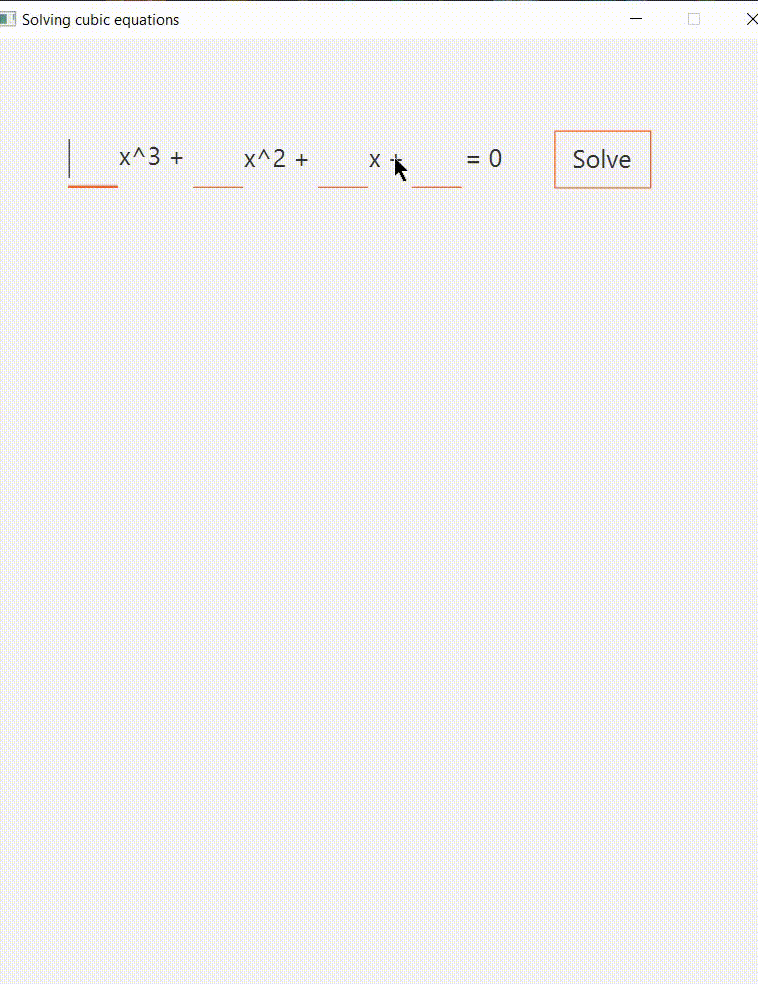

# SolverCubicEquations

Simple program to solve cubic equations

# How to use

Tap coefficients of cubic equation, then click "solve" button. You can see chart, how many roots has your equation and roots.

# How it works

The solution is achieved by taking the derivative of the cubic equation, finding the discriminant of the resulting quadratic equation. Then, depending on the sign of the discriminant, a decision is made how many solutions the original equation will have. If the discriminate is greater than zero, then one solution, if less, then it can be one, two and three.

Let's find two roots of the resulting quadratic equation. If the values ​​of the cubic equation at these points are less than epsilon, then the equation will have one solution. Also one solution will be If both of these values ​​are greater than epsilon.

2 roots will be if one of the values ​​is less than epsilon in absolute value

3 roots will be if one value is greater than epsilon, and the other is less than minus epsilon.

To find a solution on an open beam, an algorithm is used to iterate one unit to the right or left until a segment is obtained where the value in the left boundary is greater than zero and in the right one is less, or vice versa. Further, to search in this segment, dividing the segment in half is used

